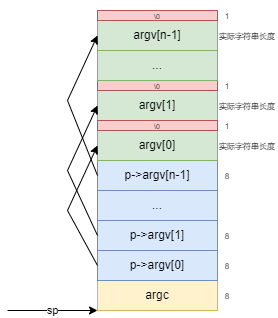

# 1.编程作业
## 1.1 扩展 easy-fs-fuse
> 跟随前面文档的指引，扩展 easy-fs-fuse，使得它可以生成同时包含 Rust 和 C 用户程序的镜像
1. 修改内核代码
   此步骤参考任务书
2. 修改Makefile
   根据项目文档的说明, 基本上完成了生成同时包含 Rust 和 C 用户程序的镜像的需求, 但`Makefile`需要进行一定的修改
   此处我基于`ch8`的代码进行修改
    ```Makefile
    FS_IMG := target/fs.img
    ...
    fs-img: $(APPS)
        @make -C ../user build TEST=$(TEST) CHAPTER=$(CHAPTER) BASE=$(BASE)
        @make -C ../testcases build
        @rm -f $(FS_IMG)
        @cp ../user/build/elf/* ../testcases/build/
        @cd ../easy-fs-fuse && cargo run --release -- -s ../testcases/build -o ../os/$(FS_IMG)
    ```
    主要区别在于, 此次构建`fs-img`之前需要先编译`testcases`目录下的c程序, 并将`user`目录下的`elf`文件复制到`testcases/build/`下, 根据`testcases/build/`生成镜像时需要将任务书中的`-t`参数替换为`-o`参数
3. 结果和测试
   在`os`下执行`make fs-img CHAPTER=8 BASE=2`, 可以生成包含c程序的文件系统镜像。
   同理，`os`下执行`make run CHAPTER=8 BASE=2`后运行`42`和`hello`程序:
   - `42`运行结果
    ```bash
    >> 42
    Shell: Process 2 exited with code 42
    ```
    可以看出`42`返回值为42, 这与期望值相符合
   - `hello`运行结果
    ```bash
    >> hello xwd
    Incorrect argc
    Shell: Process 2 exited with code 1
    >> hello
    Incorrect argc
    Shell: Process 2 exited with code 1
    ```
    可以看出, `hello`程序无论是否添加参数, 都会输出错误信息, 这也是接下来要解决的问题。
## 1.2 修改os内核支持C程序
> 在 usershell 里运行了 42 和 hello 两个用户程序。42 的运行结果是符合预期的，但 hello 的结果看起来不太对，你的任务是修改内核，使得 hello 测例给出正常输出（即给出一行以 my name is 开头的输出，且 exit_code为0）。
1. 原因分析
   阅读原`rCore`[文档](http://learningos.cn/rCore-Tutorial-Guide-2023A/chapter7/2cmdargs-and-redirection.html)与本实验[文档](https://scpointer.github.io/rcore2oscomp/docs/lab1/clib.html)
   可以看出, 二者的栈分布是不同的, 先看旧的栈内存分布
   <br>
   可以看到在此栈的内存分布中, 实际的参数放在接近栈底的位置, 其指向的实际参数在靠近栈顶的位置, 并且通过阅读源码`process.rs`中的`exec`:
    ```rust
    trap_cx.x[10] = args.len();
    trap_cx.x[11] = argv_base;
    ```
    可知参数个数`argc`时通过手动计算`args`的长度计算得到的, 并没有存储在栈上。
    阅读本实验指导书可知，C程序的栈内存分布如下：
   <br>
   在此栈的内存分布中, 实际的参数放在接近栈顶的位置, 其指向的实际参数在靠近栈底的位置， 并且栈指针指向了`argc`
   而且由`testcases/lib/main.c`可知:
    ```C
    int __start_main(long *p)
    {
    int argc = p[0];
    char **argv = (void *)(p+1);

    exit(main(argc, argv));
    return 0;
    }
    ```
    `p`是传递的栈指针`sp`, 因此`argc`会被置为栈指针当前指向的数据, 而根据前述分析可知, `argc`是存放于`a0`寄存器的, 因此后续使用`argc`时报错, 这是栈分布于C程序标准不一致导致的。
2. 修改os思路
   因此，需要将os中初始化栈分布相关的代码进行修改， 使之符合C语言的约定， 实际上我们要修改的代码位于：`os/src/task/process.rs`中的`pub fn exec(self: &Arc<Self>, elf_data: &[u8], args: Vec<String>)`
   修改内存分布为上图的形式, 次过程不难, 具体代码实现可参考: [我的实现](../os/src/task/process.rs#L184)
3. 小bug修改: 去除文件名
   观察`hello.c`源码:
    ```c
    int main(int argc, char *argv[]) {
    char greeting[11] = "my name is ";
    char error[15] = "Incorrect argc\n";
    if (argc != 1) {
        write(1, error, 15);
        return 1;
    }
    int len = 0;
    while(argv[0][len] != 0) {
        len++;
    }
    write(1, greeting, 11);
    write(1, argv[0], len);
    return 0;
    }
    ```
    可知其`argv[0]`应当为命令行输入的参数, 而非约定中的程序名, 因此需要在系统调用中对`args`中去除第一个函数名参数:
    具体代码实现可参考: [我的实现](../os/src/syscall/process.rs#L74)
4. 运行结果
   再次执行`make run CHAPTER=8 BASE=2`后运行`hello`程序
    ```bash
    Rust user shell
    >> hello xwd
    my name is xwdShell: Process 2 exited with code 0
    ```
    <br>

# 2 问答作业
1. elf 文件和 bin 文件有什么区别？
   `elf`是包含符号信息的二进制文件, `bin`文件是剥离了二进制信息的符号文件
   以下是各个命令的输出
    ```bash
    $ file elf/ch6_file0.elf
    elf/ch6_file0.elf: ELF 64-bit LSB executable, UCB RISC-V, RVC, double-float ABI, version 1 (SYSV), statically linked, stripped
    $ file bin/ch6_file0.bin
    bin/ch6_file0.bin: data
    ```
    `elf`文件包含的信息有:
      - 类型: ELF 64-bit LSB executable
      - RISC-V: 表示这是一个 RISC-V 架构的可执行文件。
      - RVC: 表示该文件使用了 RISC-V 的压缩指令集。
      - double-float ABI: 表示该文件使用了双精度浮点数 ABI（Application Binary Interface）。
      - 版本 1 (SYSV): 表示该 ELF 文件采用了 SYSV 版本 1 的格式。
      - 静态链接: 表示该文件是静态链接的，即所有的库和依赖在编译时就被链接进来了。
      - stripped: 表示该文件已经被剥离了符号信息。
    `bin`文件包含的信息有:
      - "data" 表示这是一个二进制数据文件

    总而言之, `elf`包含了程序的代码、数据、和用于指示操作系统如何运行程序的元数据, `bin`是纯二进制格式的文件，不包含元数据

    因此`riscv64-linux-musl-objdump -ld ch6_file0.bin > debug.S`命令会报错:
    ```bash
    $ riscv64-linux-musl-objdump -ld ch6_file0.bin > debug.S
    riscv64-linux-musl-objdump: ch6_file0.bin: file format not recognized
    ```
    而`riscv64-linux-musl-objdump -ld ch6_file0.elf > debug.S`可以得到反汇编文件`debug.S`